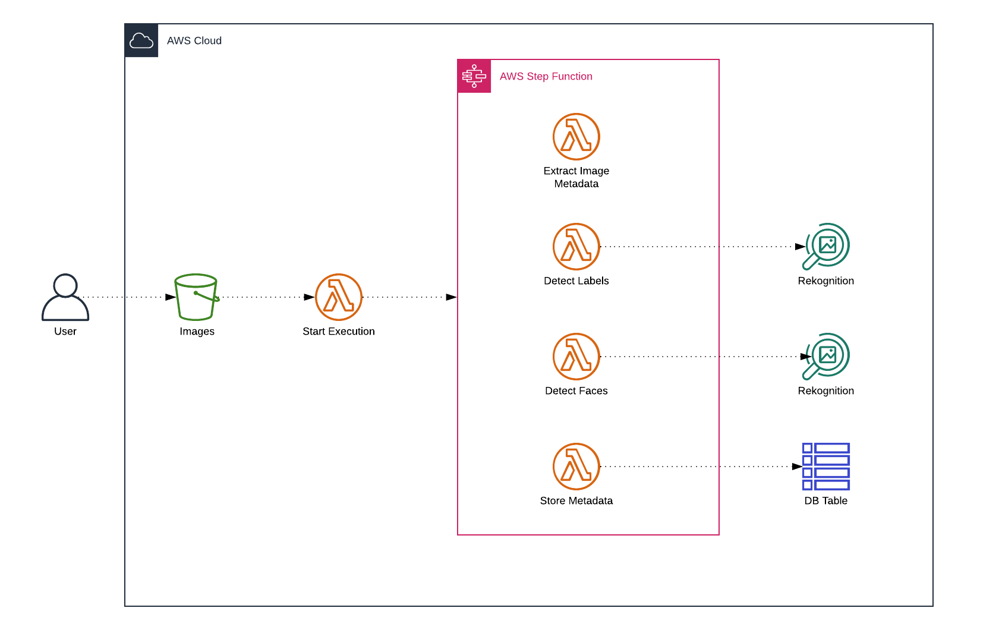
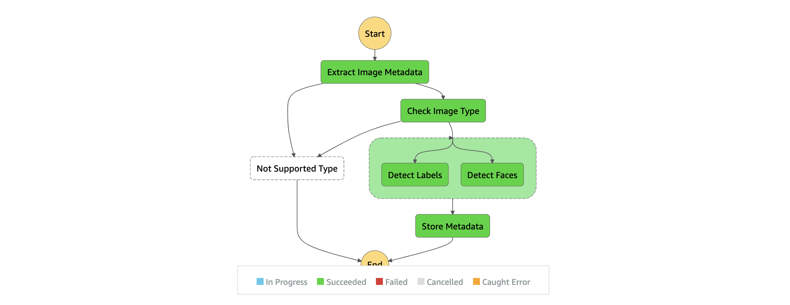

# IMAGE PROCESSOR

We will learn by doing and how to build a typical serverless application. You will use services like AWS Lambda, Amazon S3. AWS STEP FUNCTIONS, AMAZON DYNAMODB, AMAZON REKOGNITION

## ARCHITECTURE

## STATE MACHINE DIAGRAM
A system that we want to build will extract metadata from images, then will detect labels and faces, then will save everything to dynamodb.

