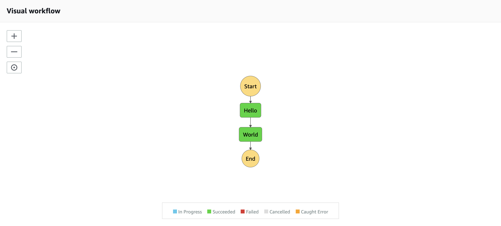

# 04 STATE MACHINE

## LAB PURPOSE

Create a Step Functions state machine, which will be coordinating our lambdas

## DEFINITIONS
----

### AWS STEP FUNCTIONS

Step Functions is a serverless orchestration service that lets you easily coordinate multiple Lambda functions into flexible workflows that are easy to debug and easy to change. Step Functions will keep your Lambda functions free of additional logic by triggering and tracking each step of your application for you

## STEPS

### CREATE A ROLE

1. Copy the **infrastructure.yaml** file from the previous lab to this directory.

2. Step Functions requires you to assign an IAM role when you create a state machine. This role will allow Step Functions to invoke lambdas. To create this role add code listed below to your cloudformation file.

```yaml
  StateMachineRole:
    Type: AWS::IAM::Role
    Properties:
      AssumeRolePolicyDocument:
        Version: "2012-10-17"
        Statement:
          -
            Effect: Allow
            Principal:
              Service:
                !Sub states.${AWS::Region}.amazonaws.com
            Action:
              - sts:AssumeRole
      Policies:
        -
          PolicyName: InvokeLambda
          PolicyDocument:
            Version: 2012-10-17
            Statement:
              -
                Sid: InvokeLambda
                Effect: Allow
                Action:
                  - lambda:InvokeFunction
                Resource: '*'
```

3. You can deploy your cloudformation template and update the stack. To do so use following commands

```bash
 aws cloudformation package --template-file infrastructure.yaml --s3-bucket $ARTIFACT_BUCKET --output-template-file image-processor-tmp.yaml
```

```bash
 aws cloudformation deploy --template-file image-processor-tmp.yaml --stack-name $PROJECT_NAME --capabilities CAPABILITY_NAMED_IAM --parameter-overrides ProjectName=$PROJECT_NAME Environment=$ENVIRONMENT
```

4. Go to IAM console **https://console.aws.amazon.com/iam**, find your role, and verify what has been created


### CREATE A STEP FUNCTIONS

1. Now is time to create a simple state machine. Step Functions use Amazon States Language. It is a JSON-based, structured language used to define your state machine, a collection of states, that can do work (Task states), determine which states to transition to next (Choice states), stop execution with an error (Fail states), and so on. To learn more, you can go to **https://docs.aws.amazon.com/step-functions/latest/dg/concepts-amazon-states-language.html**. To create a simplest state machine resource you can use code listed below. This state machine uses a role created before.


```yaml
  StateMachine:
    Type: AWS::StepFunctions::StateMachine
    Properties:
      RoleArn: !GetAtt StateMachineRole.Arn
      DefinitionString:
        !Sub
          - |-
            {
              "Comment": "A Hello World example of the Amazon States Language using Pass states",
              "StartAt": "Hello",
              "States": {
                "Hello": {
                  "Type": "Pass",
                  "Result": "Hello",
                  "Next": "World"
                },
                "World": {
                  "Type": "Pass",
                  "Result": "World",
                  "End": true
                }
              }
            }
          - {}
```

2. Deploy everything


```bash
 aws cloudformation package --template-file infrastructure.yaml --s3-bucket $ARTIFACT_BUCKET --output-template-file image-processor-tmp.yaml
```

```bash
 aws cloudformation deploy --template-file image-processor-tmp.yaml --stack-name $PROJECT_NAME --capabilities CAPABILITY_NAMED_IAM --parameter-overrides ProjectName=$PROJECT_NAME Environment=$ENVIRONMENT
```

3. Go to **https://docs.aws.amazon.com/step-functions**, find your state machine, open it, and **Start execution** . Then you should see in Visual workflow window simple hello world Step functions 

