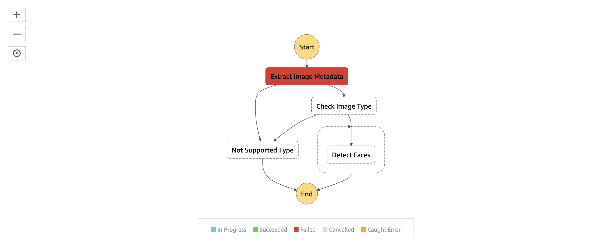

# 07 FACE DETECTION

## LAB PURPOSE

Add lambda function responsible for face detection

## DEFINITIONS
----

### AWS LAMBDA

AWS Lambda lets you run code without provisioning or managing servers. You pay only for the compute time you consume - there is no charge when your code is not running.

### AMAZON REKOGNITION

Amazon Rekognition makes it easy to add image and video analysis to your applications using proven, highly scalable, deep learning technology that requires no machine learning expertise to use. With Amazon Rekognition, you can identify objects, people, text, scenes, and activities in images and videos, as well as detect any inappropriate content


## STEPS

### CREATE LAMBDA FUNCTION

1. To detect faces you need to create a lambda function

2. The code of the lambda is prepared for you. Go to **./src/functions/detect-faces.js** file and analyze it. 

3. What you have to do right now, is to create a clouformation resource for your lambda. To do so copy first the **infrastructure.yaml** file from the previous lab to this directory. Then add resource listed below

```yaml
 DetectFacesFunction:
  Type: AWS::Serverless::Function
  Properties:
    Handler: ./src/functions/detect-faces.handler
    Policies:
      - Version: 2012-10-17
        Statement:
          - Effect: Allow
            Action:
              - s3:Get*
              - s3:List*
            Resource: '*'
      - Version: 2012-10-17
        Statement:
          - Effect: Allow
            Action:
              - rekognition:DetectFaces
            Resource: '*'
```

4. Install all dependencies

```bash
  npm install
```

5. And deploy cloudformation file

```bash
 aws cloudformation package --template-file infrastructure.yaml --s3-bucket $ARTIFACT_BUCKET --output-template-file image-processor-tmp.yaml
```

```bash
 aws cloudformation deploy --template-file image-processor-tmp.yaml --stack-name $PROJECT_NAME --capabilities CAPABILITY_NAMED_IAM --parameter-overrides ProjectName=$PROJECT_NAME Environment=$ENVIRONMENT
```

6. Verify if lambda is created

7. Now let's add our function to the state machine. We want to achieve a state machine that will trigger lambda, then lambda will download an image, extract metadata and pass this metadata to the next steps. In the next steps, we run our function for a face detection





8. To create the desired state machine you need to update your resource 

```yaml
StateMachine:
    Type: AWS::StepFunctions::StateMachine
    Properties:
      RoleArn: !GetAtt StateMachineRole.Arn
      DefinitionString:
        !Sub
          - |-
            {
              "Comment": "Image Processing workflow",
              "StartAt": "Extract Image Metadata",
              "States": {
                "Extract Image Metadata": {
                  "Type": "Task",
                  "Resource": "${ExtractMetadataFunction}",
                  "InputPath": "$",
                  "ResultPath": "$.extractedMetadata",
                  "Next": "Check Image Type",
                  "Catch": [
                    {
                      "ErrorEquals": [
                        "ImageIdentifyError"
                      ],
                      "Next": "Not Supported Type"
                    }
                  ],
                  "Retry": [
                    {
                      "ErrorEquals": [
                        "ImageIdentifyError"
                      ],
                      "MaxAttempts": 0
                    },
                    {
                      "ErrorEquals": [
                        "States.ALL"
                      ],
                      "IntervalSeconds": 1,
                      "MaxAttempts": 2
                    }
                  ]
                },
                "Check Image Type": {
                  "Type": "Choice",
                  "Choices": [
                    {
                      "Or": [
                        {
                          "Variable": "$.extractedMetadata.format",
                          "StringEquals": "jpeg"
                        },
                        {
                          "Variable": "$.extractedMetadata.format",
                          "StringEquals": "png"
                        }
                      ],
                      "Next": "Parallel Processing"
                    }
                  ],
                  "Default": "Not Supported Type"
                },
                "Not Supported Type": {
                  "Type": "Fail",
                  "Cause": "Image type not supported!",
                  "Error": "FileTypeNotSupported"
                },
                "Parallel Processing": {
                  "Type": "Parallel",
                  "Branches": [
                    {
                      "StartAt": "Detect Faces",
                      "States": {
                        "Detect Faces": {
                          "Type": "Task",
                          "Resource": "${DetectFacesFunction}",
                          "Retry": [
                            {
                              "ErrorEquals": [
                                "States.ALL"
                              ],
                              "IntervalSeconds": 1,
                              "MaxAttempts": 2
                            }
                          ],
                          "End": true
                        }
                      }
                    }
                  ],
                  "ResultPath": "$.parallelResults",
                  "End": true
                }
              }
            }
          - { 
              DetectFacesFunction: !GetAtt DetectFacesFunction.Arn,
              ExtractMetadataFunction: !GetAtt ExtractMetadataFunction.Arn
            }
```

9. Deploy everything

```bash
 aws cloudformation package --template-file infrastructure.yaml --s3-bucket $ARTIFACT_BUCKET --output-template-file image-processor-tmp.yaml
```

```bash
  aws cloudformation deploy --template-file image-processor-tmp.yaml --stack-name $PROJECT_NAME --capabilities CAPABILITY_NAMED_IAM --parameter-overrides ProjectName=$PROJECT_NAME Environment=$ENVIRONMENT
```

10. Go to S3 bucket upload an image and verify how the state machine is working