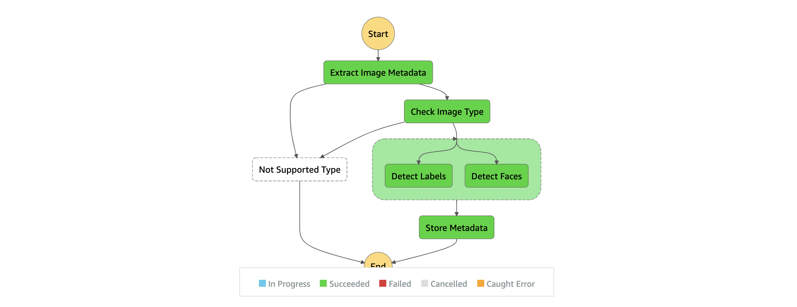

# 09 STORE METADATA

## LAB PURPOSE

Add lambda function responsible for storing all metadata in dynamodb

## DEFINITIONS
----

### AWS LAMBDA

AWS Lambda lets you run code without provisioning or managing servers. You pay only for the compute time you consume - there is no charge when your code is not running.


## STEPS

### CREATE LAMBDA FUNCTION

1. To store metadata you need to create a lambda function

2. The code of the lambda is prepared for you. Go to **./src/functions/store-metadata.js** file and analyze it. 

3. What you have to do right now, is to create a clouformation resource for your lambda. To do so copy first the **infrastructure.yaml** file from the previous lab to this directory. Try to create the resource for lambda by yourself. If you need any help to verify reference file in the directory called **solutions**

4. Install all dependencies

```bash
 npm install
```

5. And deploy cloudformation file

```bash
 aws cloudformation package --template-file infrastructure.yaml --s3-bucket $ARTIFACT_BUCKET --output-template-file image-processor-tmp.yaml
```

```bash
 aws cloudformation deploy --template-file image-processor-tmp.yaml --stack-name $PROJECT_NAME --capabilities CAPABILITY_NAMED_IAM --parameter-overrides ProjectName=$PROJECT_NAME Environment=$ENVIRONMENT
```

6. Verify if lambda is created

7. Now let's add our function to the state machine. Try to figure out how to do that. You want to achieve a state which is illustrated below. In case of any problem verify reference file



8. Deploy everything

9. Go to S3 bucket upload an image and verify how the state machine is working
